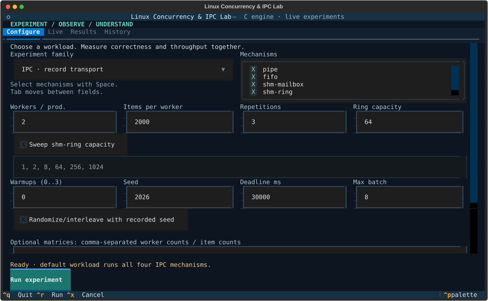
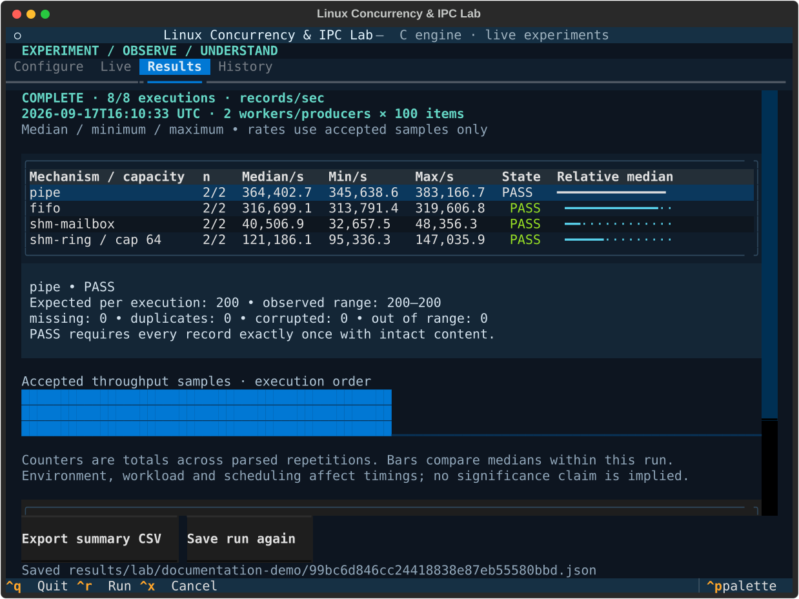

# Interactive lab demo

Use an ordinary Linux terminal, ideally at least 100 columns × 32 rows.
Follow the README setup commands, then run `./scripts/explore`.

## Screenshots

These are Textual captures of the actual app at 100×36. The result image uses
2 producers × 100 records and two repetitions. Its tiny-workload timings are
illustrative UI data, not comparative benchmark evidence.





## Two-minute walkthrough

1. In Configure, leave IPC selected. Set workers/producers to **2**, items per
   worker to **100**, and repetitions to **2**. Leave all four mechanisms selected.
2. Run with Ctrl+R. Watch Live show the real mechanism/repetition and completed
   execution count. Eight completed executions lead to Results automatically.
3. Select each row with the arrow keys. Inspect expected/received counts and the
   missing/duplicate/corrupted/out-of-range totals. The example should show PASS;
   investigate any failure instead of treating its rate as a valid measurement.
4. Export summary CSV. The resulting path appears below the action buttons.
   Raw C output remains available in Results and in the saved JSON.
5. Repeat the same configuration. Open History, pin one run as baseline, select
   the other, and Compare. Differences in these tiny timings are descriptive and
   strongly influenced by startup and scheduling; they are not performance claims.
6. Return to Configure. Deselect pipe, fifo and shm-mailbox. Enable the ring sweep
   and retain `1, 2, 8, 64, 256, 1024`. Run and inspect the six capacity rows.
7. Switch to synchronization. Run all three mechanisms with the same small
   workload. Observe that process-unsafe is labeled RACY even if its count happens
   to match expected. Its rate is attempted operations/sec.

## Cancellation and validation

- Use 2 producers × 10,000 items and 5 repetitions, then Run. Press Ctrl+X during
  an execution. The current case finishes, later cases are skipped, and partial
  results are saved with CANCELLED status. Ctrl+Q also drains and saves before
  quitting. Do not use force-kill to demonstrate ordinary cancellation.
- Enter `0` or `1; echo invalid` into the workers field. Run explains the error
  and launches no process. Restore a positive integer to continue.
- Resize to 80×24. Use Tab and scroll to reach additional form fields; focus tables
  and use arrow keys to inspect rows and wider columns. Ctrl+R/Ctrl+X remain usable.
- Close and reopen the app. Saved runs remain in History. A failed save is shown
  explicitly and can be retried with Save run again.

## Automated end-to-end equivalent

```sh
make release
.venv/bin/python -m unittest discover -s tests/lab -p test_ui.py -v
```

These focused headless Pilot tests drive the same app widgets and event handlers,
execute the real C binary, save/reload history and export CSVs. They also cover
the 60×20 keyboard workflow and safe cancellation/quit. No synthetic throughput
is displayed in the real-engine tests. The mocked slow-run tests are solely for
deterministic cancellation and failure-path checks.
